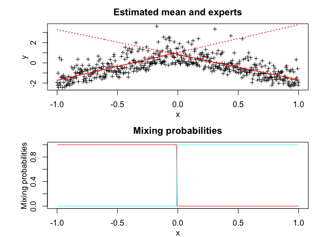
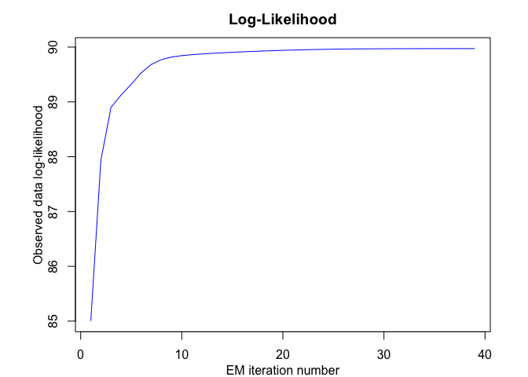

<!-- README.md is generated from README.Rmd. Please edit that file -->

<!-- badges: start -->

<!-- badges: end -->

# Overview

**SNMoE** (Skew-Normal Mixtures-of-Experts) provides a flexible
modelling framework for heterogenous data with possibly skewed
distributions to generalize the standard Normal mixture of expert model.
**SNMoE** consists of a mixture of *K* skew-Normal expert regressors
network (of degree *p*) gated by a softmax gating network (of degree
*q*) and is represented by:

  - The gating network parameters `alpha`’s of the softmax net.
  - The experts network parameters: The location parameters (regression
    coefficients) `beta`’s, scale parameters `sigma`’s, and the skewness
    parameters `lambda`’s. **SNMoE** thus generalises mixtures of
    (normal, skew-normal) distributions and mixtures of regressions with
    these distributions. For example, when \(q=0\), we retrieve mixtures
    of (skew-normal, or normal) regressions, and when both \(p=0\) and
    \(q=0\), it is a mixture of (skew-normal, or normal) distributions.
    It also reduces to the standard (normal, skew-normal) distribution
    when we only use a single expert (\(K=1\)).

Model estimation/learning is performed by a dedicated expectation
conditional maximization (ECM) algorithm by maximizing the observed data
log-likelihood. We provide simulated examples to illustrate the use of
the model in model-based clustering of heterogeneous regression data and
in fitting non-linear regression functions.

# Installation

You can install the development version of SNMoE from
[GitHub](https://github.com/) with:

``` r
# install.packages("devtools")
devtools::install_github("fchamroukhi/SNMoE")
```

To build *vignettes* for examples of usage, type the command below
instead:

``` r
# install.packages("devtools")
devtools::install_github("fchamroukhi/SNMoE", 
                         build_opts = c("--no-resave-data", "--no-manual"), 
                         build_vignettes = TRUE)
```

Use the following command to display vignettes:

``` r
browseVignettes("SNMoE")
```

# Usage

``` r
library(SNMoE)
```

``` r
# Application to a simulated data set

n <- 500 # Size of the sample
alphak <- matrix(c(0, 8), ncol = 1) # Parameters of the gating network
betak <- matrix(c(0, -2.5, 0, 2.5), ncol = 2) # Regression coefficients of the experts
lambdak <- c(3, 5) # Skewness parameters of the experts
sigmak <- c(1, 1) # Standard deviations of the experts
x <- seq.int(from = -1, to = 1, length.out = n) # Inputs (predictors)

# Generate sample of size n
sample <- sampleUnivSNMoE(alphak = alphak, betak = betak, 
                          sigmak = sigmak, lambdak = lambdak, 
                          x = x)
y <- sample$y

K <- 2 # Number of regressors/experts
p <- 1 # Order of the polynomial regression (regressors/experts)
q <- 1 # Order of the logistic regression (gating network)

snmoe <- emSNMoE(X = x, Y = y, K = K, p = p, q = q, verbose = TRUE)
#> EM - SNMoE: Iteration: 1 | log-likelihood: -565.146183083903
#> EM - SNMoE: Iteration: 2 | log-likelihood: -547.207659306349
#> EM - SNMoE: Iteration: 3 | log-likelihood: -546.695329076557
#> EM - SNMoE: Iteration: 4 | log-likelihood: -546.569722258092
#> EM - SNMoE: Iteration: 5 | log-likelihood: -546.510014215213
#> EM - SNMoE: Iteration: 6 | log-likelihood: -546.463222377737
#> EM - SNMoE: Iteration: 7 | log-likelihood: -546.420780026259
#> EM - SNMoE: Iteration: 8 | log-likelihood: -546.381781026586
#> EM - SNMoE: Iteration: 9 | log-likelihood: -546.346188641772
#> EM - SNMoE: Iteration: 10 | log-likelihood: -546.313842690113
#> EM - SNMoE: Iteration: 11 | log-likelihood: -546.28436685838
#> EM - SNMoE: Iteration: 12 | log-likelihood: -546.257463060397
#> EM - SNMoE: Iteration: 13 | log-likelihood: -546.232630180285
#> EM - SNMoE: Iteration: 14 | log-likelihood: -546.209424828986
#> EM - SNMoE: Iteration: 15 | log-likelihood: -546.187455392976
#> EM - SNMoE: Iteration: 16 | log-likelihood: -546.166373943969
#> EM - SNMoE: Iteration: 17 | log-likelihood: -546.1458820117
#> EM - SNMoE: Iteration: 18 | log-likelihood: -546.125700475231
#> EM - SNMoE: Iteration: 19 | log-likelihood: -546.105596743628
#> EM - SNMoE: Iteration: 20 | log-likelihood: -546.085482501977
#> EM - SNMoE: Iteration: 21 | log-likelihood: -546.06532062382
#> EM - SNMoE: Iteration: 22 | log-likelihood: -546.045088563158
#> EM - SNMoE: Iteration: 23 | log-likelihood: -546.024641524877
#> EM - SNMoE: Iteration: 24 | log-likelihood: -546.004483329619
#> EM - SNMoE: Iteration: 25 | log-likelihood: -545.98498701792
#> EM - SNMoE: Iteration: 26 | log-likelihood: -545.966436138292
#> EM - SNMoE: Iteration: 27 | log-likelihood: -545.948980149474
#> EM - SNMoE: Iteration: 28 | log-likelihood: -545.932523850693
#> EM - SNMoE: Iteration: 29 | log-likelihood: -545.917459429099
#> EM - SNMoE: Iteration: 30 | log-likelihood: -545.903876928041
#> EM - SNMoE: Iteration: 31 | log-likelihood: -545.891803048691
#> EM - SNMoE: Iteration: 32 | log-likelihood: -545.881228282862
#> EM - SNMoE: Iteration: 33 | log-likelihood: -545.872023855871
#> EM - SNMoE: Iteration: 34 | log-likelihood: -545.864063038879
#> EM - SNMoE: Iteration: 35 | log-likelihood: -545.8572167745
#> EM - SNMoE: Iteration: 36 | log-likelihood: -545.851363681219
#> EM - SNMoE: Iteration: 37 | log-likelihood: -545.84632520505
#> EM - SNMoE: Iteration: 38 | log-likelihood: -545.842088067884
#> EM - SNMoE: Iteration: 39 | log-likelihood: -545.83842036459
#> EM - SNMoE: Iteration: 40 | log-likelihood: -545.835255481842
#> EM - SNMoE: Iteration: 41 | log-likelihood: -545.832494358929
#> EM - SNMoE: Iteration: 42 | log-likelihood: -545.830050149451
#> EM - SNMoE: Iteration: 43 | log-likelihood: -545.827873462522
#> EM - SNMoE: Iteration: 44 | log-likelihood: -545.825917962016
#> EM - SNMoE: Iteration: 45 | log-likelihood: -545.824152931994
#> EM - SNMoE: Iteration: 46 | log-likelihood: -545.822565536317
#> EM - SNMoE: Iteration: 47 | log-likelihood: -545.821112843171
#> EM - SNMoE: Iteration: 48 | log-likelihood: -545.819770119428
#> EM - SNMoE: Iteration: 49 | log-likelihood: -545.81852478816
#> EM - SNMoE: Iteration: 50 | log-likelihood: -545.817371438309
#> EM - SNMoE: Iteration: 51 | log-likelihood: -545.81629471026
#> EM - SNMoE: Iteration: 52 | log-likelihood: -545.815281877933
#> EM - SNMoE: Iteration: 53 | log-likelihood: -545.814316442336
#> EM - SNMoE: Iteration: 54 | log-likelihood: -545.813405066116
#> EM - SNMoE: Iteration: 55 | log-likelihood: -545.812537952873
#> EM - SNMoE: Iteration: 56 | log-likelihood: -545.811710848405
#> EM - SNMoE: Iteration: 57 | log-likelihood: -545.81091946097
#> EM - SNMoE: Iteration: 58 | log-likelihood: -545.810161968873
#> EM - SNMoE: Iteration: 59 | log-likelihood: -545.809434097225
#> EM - SNMoE: Iteration: 60 | log-likelihood: -545.808734289785
#> EM - SNMoE: Iteration: 61 | log-likelihood: -545.808065742603
#> EM - SNMoE: Iteration: 62 | log-likelihood: -545.807424777878
#> EM - SNMoE: Iteration: 63 | log-likelihood: -545.806809312377
#> EM - SNMoE: Iteration: 64 | log-likelihood: -545.806217173512
#> EM - SNMoE: Iteration: 65 | log-likelihood: -545.805643481812
#> EM - SNMoE: Iteration: 66 | log-likelihood: -545.805089482011
#> EM - SNMoE: Iteration: 67 | log-likelihood: -545.804561070461

snmoe$summary()
#> -----------------------------------------------
#> Fitted Skew-Normal Mixture-of-Experts model
#> -----------------------------------------------
#> 
#> SNMoE model with K = 2 experts:
#> 
#>  log-likelihood df       AIC       BIC       ICL
#>       -545.8046 10 -555.8046 -576.8776 -576.9326
#> 
#> Clustering table (Number of observations in each expert):
#> 
#>   1   2 
#> 248 252 
#> 
#> Regression coefficients:
#> 
#>     Beta(k = 1) Beta(k = 2)
#> 1      1.074983   0.8599016
#> X^1    2.754603  -2.4841611
#> 
#> Variances:
#> 
#>  Sigma2(k = 1) Sigma2(k = 2)
#>      0.5473148     0.4982959

snmoe$plot()
```



``` r
# Application to a real data set

data("tempanomalies")
x <- tempanomalies$Year
y <- tempanomalies$AnnualAnomaly

K <- 2 # Number of regressors/experts
p <- 1 # Order of the polynomial regression (regressors/experts)
q <- 1 # Order of the logistic regression (gating network)

snmoe <- emSNMoE(X = x, Y = y, K = K, p = p, q = q, verbose = TRUE)
#> EM - SNMoE: Iteration: 1 | log-likelihood: 85.0045061339411
#> EM - SNMoE: Iteration: 2 | log-likelihood: 87.9385988227055
#> EM - SNMoE: Iteration: 3 | log-likelihood: 88.8991875811879
#> EM - SNMoE: Iteration: 4 | log-likelihood: 89.126179374564
#> EM - SNMoE: Iteration: 5 | log-likelihood: 89.3207573273064
#> EM - SNMoE: Iteration: 6 | log-likelihood: 89.5327587640959
#> EM - SNMoE: Iteration: 7 | log-likelihood: 89.6849967873675
#> EM - SNMoE: Iteration: 8 | log-likelihood: 89.7720112883498
#> EM - SNMoE: Iteration: 9 | log-likelihood: 89.8185258407313
#> EM - SNMoE: Iteration: 10 | log-likelihood: 89.8444155545812
#> EM - SNMoE: Iteration: 11 | log-likelihood: 89.8613889003063
#> EM - SNMoE: Iteration: 12 | log-likelihood: 89.8747703527544
#> EM - SNMoE: Iteration: 13 | log-likelihood: 89.886097927436
#> EM - SNMoE: Iteration: 14 | log-likelihood: 89.8959952572076
#> EM - SNMoE: Iteration: 15 | log-likelihood: 89.9049706666923
#> EM - SNMoE: Iteration: 16 | log-likelihood: 89.9132597594297
#> EM - SNMoE: Iteration: 17 | log-likelihood: 89.9209354105984
#> EM - SNMoE: Iteration: 18 | log-likelihood: 89.9280131855072
#> EM - SNMoE: Iteration: 19 | log-likelihood: 89.9344928446672
#> EM - SNMoE: Iteration: 20 | log-likelihood: 89.9403729178138
#> EM - SNMoE: Iteration: 21 | log-likelihood: 89.945656289178
#> EM - SNMoE: Iteration: 22 | log-likelihood: 89.9504768460938
#> EM - SNMoE: Iteration: 23 | log-likelihood: 89.9547925828658
#> EM - SNMoE: Iteration: 24 | log-likelihood: 89.9585196272296
#> EM - SNMoE: Iteration: 25 | log-likelihood: 89.9616844986845
#> EM - SNMoE: Iteration: 26 | log-likelihood: 89.9643151527205
#> EM - SNMoE: Iteration: 27 | log-likelihood: 89.9667285718634
#> EM - SNMoE: Iteration: 28 | log-likelihood: 89.9677851946997
#> EM - SNMoE: Iteration: 29 | log-likelihood: 89.9688413843811
#> EM - SNMoE: Iteration: 30 | log-likelihood: 89.9696714558448
#> EM - SNMoE: Iteration: 31 | log-likelihood: 89.9703997264651
#> EM - SNMoE: Iteration: 32 | log-likelihood: 89.9709314334509
#> EM - SNMoE: Iteration: 33 | log-likelihood: 89.9716838264667
#> EM - SNMoE: Iteration: 34 | log-likelihood: 89.9720039938139
#> EM - SNMoE: Iteration: 35 | log-likelihood: 89.9721543298507
#> EM - SNMoE: Iteration: 36 | log-likelihood: 89.9724089801314
#> EM - SNMoE: Iteration: 37 | log-likelihood: 89.9725175003354
#> EM - SNMoE: Iteration: 38 | log-likelihood: 89.9726123946923
#> EM - SNMoE: Iteration: 39 | log-likelihood: 89.9726324345036

snmoe$summary()
#> -----------------------------------------------
#> Fitted Skew-Normal Mixture-of-Experts model
#> -----------------------------------------------
#> 
#> SNMoE model with K = 2 experts:
#> 
#>  log-likelihood df      AIC      BIC     ICL
#>        89.97263 10 79.97263 65.40936 65.2984
#> 
#> Clustering table (Number of observations in each expert):
#> 
#>  1  2 
#> 70 66 
#> 
#> Regression coefficients:
#> 
#>       Beta(k = 1)  Beta(k = 2)
#> 1   -14.093277359 -33.78266985
#> X^1   0.007211785   0.01719755
#> 
#> Variances:
#> 
#>  Sigma2(k = 1) Sigma2(k = 2)
#>     0.01467777    0.01723027

snmoe$plot()
```


