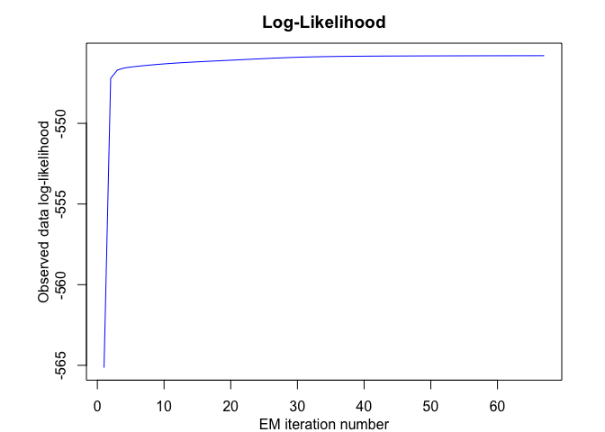

<!-- README.md is generated from README.Rmd. Please edit that file -->

<!-- badges: start -->

<!-- badges: end -->

# Overview

User-friendly and flexible algorithm for modeling, sampling, inference,
and clustering heteregenous data with the Skew-Normal Mixture-of-Experts
(SNMoE) model.

# Installation

You can install the development version of STMoE from
[GitHub](https://github.com/) with:

``` r
# install.packages("devtools")
devtools::install_github("fchamroukhi/SNMoE")
```

To build *vignettes* for examples of usage, type the command below
instead:

``` r
# install.packages("devtools")
devtools::install_github("fchamroukhi/SNMoE", 
                         build_opts = c("--no-resave-data", "--no-manual"), 
                         build_vignettes = TRUE)
```

Use the following command to display vignettes:

``` r
browseVignettes("SNMoE")
```

# Usage

``` r
library(SNMoE)
```

``` r
n <- 500 # Size of the sample
K <- 2 # Number of regressors/experts
p <- 1 # Order of the polynomial regression (regressors/experts)
q <- 1 # Order of the logistic regression (gating network)

alphak <- matrix(c(0, 8), ncol = K - 1) # Parameters of the gating network
betak <- matrix(c(0, -2.5, 0, 2.5), ncol = K) # Regression coefficients of the experts
lambdak <- c(3, 5) # Skewness parameters of the experts
sigmak <- c(1, 1) # Standard deviations of the experts
x <- seq.int(from = -1, to = 1, length.out = n) # Inputs (predictors)

# Generate sample of size n
sample <- sampleUnivSNMoE(alphak = alphak, betak = betak, sigmak = sigmak, 
                          lambdak = lambdak, x = x)

n_tries <- 1
max_iter = 1500
threshold <- 1e-6
verbose <- TRUE
verbose_IRLS <- FALSE

snmoe <- emSNMoE(x, matrix(sample$y), K, p, q, n_tries, max_iter, 
                 threshold, verbose, verbose_IRLS)
#> EM: Iteration: 1 || log-likelihood: -809.30193348525
#> EM: Iteration: 2 || log-likelihood: -528.538332311711
#> EM: Iteration: 3 || log-likelihood: -523.517183552896
#> EM: Iteration: 4 || log-likelihood: -521.861104050473
#> EM: Iteration: 5 || log-likelihood: -521.007101823702
#> EM: Iteration: 6 || log-likelihood: -520.498265158501
#> EM: Iteration: 7 || log-likelihood: -520.145647092551
#> EM: Iteration: 8 || log-likelihood: -519.864178023745
#> EM: Iteration: 9 || log-likelihood: -519.615062761274
#> EM: Iteration: 10 || log-likelihood: -519.380775883412
#> EM: Iteration: 11 || log-likelihood: -519.153418630528
#> EM: Iteration: 12 || log-likelihood: -518.929382386202
#> EM: Iteration: 13 || log-likelihood: -518.706960169035
#> EM: Iteration: 14 || log-likelihood: -518.485368813719
#> EM: Iteration: 15 || log-likelihood: -518.263996781481
#> EM: Iteration: 16 || log-likelihood: -518.042437198205
#> EM: Iteration: 17 || log-likelihood: -517.820417926788
#> EM: Iteration: 18 || log-likelihood: -517.597738238638
#> EM: Iteration: 19 || log-likelihood: -517.37429436596
#> EM: Iteration: 20 || log-likelihood: -517.150080371534
#> EM: Iteration: 21 || log-likelihood: -516.925178961815
#> EM: Iteration: 22 || log-likelihood: -516.699799636342
#> EM: Iteration: 23 || log-likelihood: -516.474251394726
#> EM: Iteration: 24 || log-likelihood: -516.248939710556
#> EM: Iteration: 25 || log-likelihood: -516.024351231224
#> EM: Iteration: 26 || log-likelihood: -515.801039550032
#> EM: Iteration: 27 || log-likelihood: -515.5796151142
#> EM: Iteration: 28 || log-likelihood: -515.360701912923
#> EM: Iteration: 29 || log-likelihood: -515.144924822328
#> EM: Iteration: 30 || log-likelihood: -514.932972137618
#> EM: Iteration: 31 || log-likelihood: -514.725491273596
#> EM: Iteration: 32 || log-likelihood: -514.523084365071
#> EM: Iteration: 33 || log-likelihood: -514.326316379976
#> EM: Iteration: 34 || log-likelihood: -514.1356830295
#> EM: Iteration: 35 || log-likelihood: -513.951612349154
#> EM: Iteration: 36 || log-likelihood: -513.77446165116
#> EM: Iteration: 37 || log-likelihood: -513.604527177093
#> EM: Iteration: 38 || log-likelihood: -513.442019997334
#> EM: Iteration: 39 || log-likelihood: -513.287066663041
#> EM: Iteration: 40 || log-likelihood: -513.139756866528
#> EM: Iteration: 41 || log-likelihood: -513.000104729632
#> EM: Iteration: 42 || log-likelihood: -512.86806163243
#> EM: Iteration: 43 || log-likelihood: -512.743525196033
#> EM: Iteration: 44 || log-likelihood: -512.626346603561
#> EM: Iteration: 45 || log-likelihood: -512.516336155586
#> EM: Iteration: 46 || log-likelihood: -512.413273299632
#> EM: Iteration: 47 || log-likelihood: -512.316919681751
#> EM: Iteration: 48 || log-likelihood: -512.227017716348
#> EM: Iteration: 49 || log-likelihood: -512.143272556348
#> EM: Iteration: 50 || log-likelihood: -512.065388594305
#> EM: Iteration: 51 || log-likelihood: -511.993064491466
#> EM: Iteration: 52 || log-likelihood: -511.925997072498
#> EM: Iteration: 53 || log-likelihood: -511.863884692687
#> EM: Iteration: 54 || log-likelihood: -511.806430052642
#> EM: Iteration: 55 || log-likelihood: -511.753342519003
#> EM: Iteration: 56 || log-likelihood: -511.704340112476
#> EM: Iteration: 57 || log-likelihood: -511.659151074811
#> EM: Iteration: 58 || log-likelihood: -511.617514811711
#> EM: Iteration: 59 || log-likelihood: -511.579182560259
#> EM: Iteration: 60 || log-likelihood: -511.543903403283
#> EM: Iteration: 61 || log-likelihood: -511.511445745963
#> EM: Iteration: 62 || log-likelihood: -511.481620796997
#> EM: Iteration: 63 || log-likelihood: -511.454227970617
#> EM: Iteration: 64 || log-likelihood: -511.429076631099
#> EM: Iteration: 65 || log-likelihood: -511.405992056884
#> EM: Iteration: 66 || log-likelihood: -511.384811597376
#> EM: Iteration: 67 || log-likelihood: -511.365383890178
#> EM: Iteration: 68 || log-likelihood: -511.347568331925
#> EM: Iteration: 69 || log-likelihood: -511.331234533766
#> EM: Iteration: 70 || log-likelihood: -511.316261765997
#> EM: Iteration: 71 || log-likelihood: -511.302538399817
#> EM: Iteration: 72 || log-likelihood: -511.289961353389
#> EM: Iteration: 73 || log-likelihood: -511.278435548155
#> EM: Iteration: 74 || log-likelihood: -511.267873380111
#> EM: Iteration: 75 || log-likelihood: -511.258194209626
#> EM: Iteration: 76 || log-likelihood: -511.2493238724
#> EM: Iteration: 77 || log-likelihood: -511.241194213355
#> EM: Iteration: 78 || log-likelihood: -511.233742644564
#> EM: Iteration: 79 || log-likelihood: -511.226911727773
#> EM: Iteration: 80 || log-likelihood: -511.22064878161
#> EM: Iteration: 81 || log-likelihood: -511.214905513257
#> EM: Iteration: 82 || log-likelihood: -511.209637674049
#> EM: Iteration: 83 || log-likelihood: -511.204804738275
#> EM: Iteration: 84 || log-likelihood: -511.200369604325
#> EM: Iteration: 85 || log-likelihood: -511.19629831716
#> EM: Iteration: 86 || log-likelihood: -511.192559811096
#> EM: Iteration: 87 || log-likelihood: -511.189125671769
#> EM: Iteration: 88 || log-likelihood: -511.185970462829
#> EM: Iteration: 89 || log-likelihood: -511.183069955109
#> EM: Iteration: 90 || log-likelihood: -511.180402383286
#> EM: Iteration: 91 || log-likelihood: -511.177947871579
#> EM: Iteration: 92 || log-likelihood: -511.175688270098
#> EM: Iteration: 93 || log-likelihood: -511.173606995249
#> EM: Iteration: 94 || log-likelihood: -511.17168890536
#> EM: Iteration: 95 || log-likelihood: -511.169920169514
#> EM: Iteration: 96 || log-likelihood: -511.168288155657
#> EM: Iteration: 97 || log-likelihood: -511.166781326658
#> EM: Iteration: 98 || log-likelihood: -511.165389145263
#> EM: Iteration: 99 || log-likelihood: -511.164101987227
#> EM: Iteration: 100 || log-likelihood: -511.162911061922
#> EM: Iteration: 101 || log-likelihood: -511.161808339786
#> EM: Iteration: 102 || log-likelihood: -511.160786486026
#> EM: Iteration: 103 || log-likelihood: -511.159838800044
#> EM: Iteration: 104 || log-likelihood: -511.158959160109
#> EM: Iteration: 105 || log-likelihood: -511.158141972819
#> EM: Iteration: 106 || log-likelihood: -511.157382126954
#> EM: Iteration: 107 || log-likelihood: -511.156674951342
#> EM: Iteration: 108 || log-likelihood: -511.156016176395
#> EM: Iteration: 109 || log-likelihood: -511.155401899002
#> EM: Iteration: 110 || log-likelihood: -511.154828344449
#> EM: Iteration: 111 || log-likelihood: -511.154291887864
#> EM: Iteration: 112 || log-likelihood: -511.153789489569

snmoe$plot()
```


